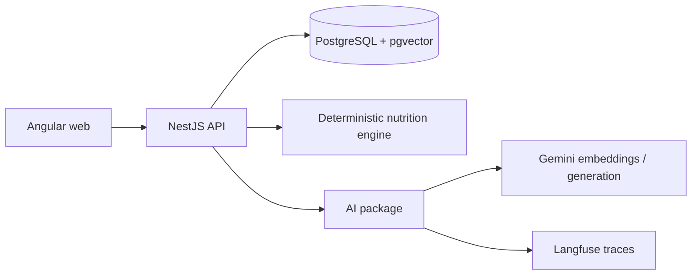

# Architecture

PantryFlow is a pnpm workspace with a clear boundary between deterministic product behavior and
AI orchestration. Angular serves the user interface, NestJS owns HTTP and application services,
and the shared packages keep domain contracts reusable.

The nutrition engine calculates and validates nutrition, inventory rules protect stock, and API
services own persistence. The AI package provides embeddings, hybrid RAG, request routing, typed
tools, bounded agent orchestration, evaluation metrics, and observability. Agents receive tools
through dependency injection and never query the database directly.

Local development uses Docker Compose for pgvector. The deployment topology is Vercel for the
frontend, Render for the API, Supabase PostgreSQL for the database, Gemini for model services, and
Langfuse for traces. See [deployment](deployment.md) for provider configuration.
